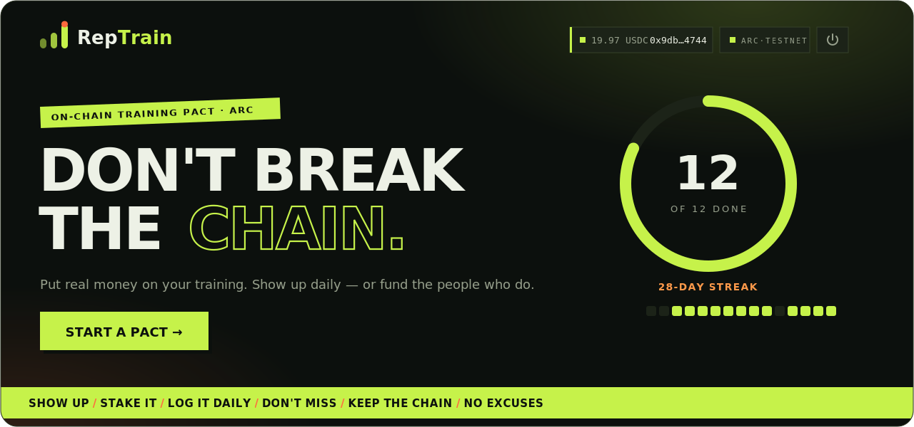

  

<h1 align="center">RepTrain</h1>

<b>Put money on your training. Show up — or fund the people who do.</b>

  
  
  
  

---

Streak apps are free, so quitting one costs you nothing — which is exactly why they don't work.
**RepTrain** puts your own USDC on the line.

Open a **pact** — a goal of N sessions inside a window — and back it with a stake. Log one session a
day, on-chain. Finish in time and you pull your stake back **plus a slice of everyone who flaked**.
Miss your window and your stake *becomes* that slice. Skin in the game, settled in dollars, the moment
it happens.

→ **Try it: [reptrain-arc.vercel.app](https://reptrain-arc.vercel.app)** · ARC Testnet

## The house rules

1. **Stake to enter.** No stake, no pact. Skin in the game or the streak doesn't mean anything.
2. **One a day.** A session a day keeps the chain alive — miss a day and the streak resets.
3. **Finish, get paid.** Hit your number in time and claim your stake, plus up to **half again** from the comeback pool.
4. **Flake, fund it.** Let the window close short and your stake drops into the pot for the people who don't quit.

## How a pact works

| Action | What happens on-chain |
| --- | --- |
| `start(goal, days)` | Locks your USDC, opens the pact. |
| `checkIn()` | Logs one session per UTC day — grows your streak and your training calendar. |
| `claim()` | Pays you out once you hit the goal: stake **+** a comeback bonus. |
| `forfeit(addr)` | Settles an expired, unfinished pact. **Anyone** can call it — a keeper, a bot — and the stake feeds the pot. |

Your streaks, sessions and wins live on-chain. That record is your **Rep**.

## Built right, not just fast

- **One immutable contract**, money-safe by design — checks-effects-interactions, a pull-free payout
  path, and a comeback pool that can never pay out more than it holds.
- **Native USDC on ARC** — stakes and payouts are plain dollars. No token to buy, no approval to sign,
  in your wallet the *same second* you claim.
- **Forfeits sweep themselves** — settling an expired pact is one open call, so a keeper or an agent
  can clear it and grow the pot with zero admin.
- **Adversarially reviewed before deploy** — a 15-agent pass over the contract and frontend (weighted
  on fund-safety) found **zero money bugs**; everything flagged was fixed pre-deploy.
- **Source-verified** on [ArcScan](https://testnet.arcscan.app/address/0x21d74586c0d9d8526aD4EF60Cf153Cf3D2394F07).

## Under the hood

`Next.js 16` · `React 19` · `ethers v6` · one `Solidity 0.8.35` contract · EIP-6963 multi-wallet ·
**no backend** — the UI reads straight from the chain.

Contract
[`0x21d74586c0d9d8526aD4EF60Cf153Cf3D2394F07`](https://testnet.arcscan.app/address/0x21d74586c0d9d8526aD4EF60Cf153Cf3D2394F07)
— ARC Testnet, chain `5042002`.
